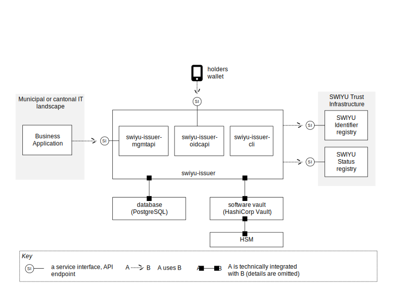

# swiyu-issuer

A multi-tenant credential issuer service for [SWIYU](https://www.eid.admin.ch/) —
the Swiss eID infrastructure. Issues verifiable credentials over
[OID4VCI][oid4vci], manages their status via signed status lists, and manages
the lifecycle of issuers (create, rotate keys, deactivate) against the SWIYU
Identifier Registry.



Part of the [`swiyu-rs`](../README.md) workspace.

## Status

Work in progress. The service runs end-to-end against the SWIYU integration
environment, but APIs and on-disk state are not yet stable.

`swiyu-issuer` currently issues credentials against DIDs registered with
`did:tdw` 0.3. `did:webvh` 1.0 code paths exist in the workspace but are
unverified — see the [workspace README](../README.md).

## Binaries

The crate produces three binaries:

| Binary                    | Role                                                              | Default port |
|---------------------------|-------------------------------------------------------------------|--------------|
| `swiyu-issuer-mgmtapi`    | Management API consumed by a tenant's business application: register issuers, manage their lifecycle, create credential offers. Bearer-token auth, tenant-scoped. | `8080`       |
| `swiyu-issuer-oidcapi`    | Wallet-facing OID4VCI API: metadata, offer URIs, token + credential endpoints. Public, no `Authorization` header. | `8081`       |
| `swiyu-issuer-cli`        | Operator CLI: tenant bootstrap, API token minting, dev-loop helpers. | n/a          |

The two HTTP binaries share a Postgres database and an `ISSUER_BASE_URL`; a
production deployment puts them behind the same reverse proxy. OpenAPI specs
ship in the repo:

- [`openapi-mgmt.yml`](./openapi-mgmt.yml) — management API
- [`openapi-oidc.yml`](./openapi-oidc.yml) — wallet-facing OID4VCI API

## Architecture at a glance

- **Storage** — PostgreSQL. Migrations run on startup via the binary itself,
  not by an external migration tool.
- **Signing & secret encryption** — pluggable engines. `vault` (HashiCorp
  Vault Transit, the default for the bundled compose stack) keeps private
  keys and OAuth2 client secrets out of plaintext storage. A `dev` engine
  exists as a fallback for fully-local experimentation; its master key is
  the publicly known string baked into `.env.example`, so anything it
  encrypts is in effect plaintext.
- **OAuth2** — the service holds a refresh token for the tenant's SWIYU
  Business Partner and refreshes access tokens on demand to call the
  Identifier and Status registries.
- **Multi-tenant** — every row is scoped to a tenant; API tokens are
  tenant-scoped and minted via `swiyu-issuer-cli tenant api-token mint`.

The `specs/` directory contains the design notes and topic plans behind these
choices.

## Just run it

If you want to experiment without cloning the repo or installing a Rust
toolchain, use the **explorer deploy bundle**: a standalone `docker-compose.yml`
that pulls prebuilt images from GHCR.

→ [`deploy/explorer/README.md`](./deploy/explorer/README.md)

You'll need Docker, an [ePortal](https://eportal.admin.ch/) account with a
registered Business Partner, and the two files in `deploy/explorer/`. The
bundle is **not hardened** — see the warning at the top of its README.

## Build and run from source

### Prerequisites

- Rust stable toolchain (edition 2024).
- Docker Engine 25+ with Compose v2 — used for the local Postgres + Vault
  side-cars.
- An ePortal Business Partner whose credentials you can paste into `.env`.

### Run the dev stack

```sh
cd swiyu-issuer

# Copy .env.example to .env and fill in your SWIYU Business Partner values.
cp .env.example .env
$EDITOR .env

# Brings up Postgres, Vault (dev mode), swiyu-issuer-mgmtapi,
# swiyu-issuer-oidcapi, and the bootstrap-dev-tenant one-shot that
# seeds your tenant from .env.
docker compose up -d
```

`direnv` will load `.env` automatically on `cd` via the sibling
[`.envrc`](./.envrc) if you have it installed.

### Run a binary directly with cargo

The compose stack runs the binaries in containers; to iterate on the code
itself, run the binary natively against the side-cars:

```sh
# Bring up just the side-cars.
docker compose up -d postgres vault vault-init

# Run the management API on the host.
cargo run --bin swiyu-issuer-mgmtapi

# In another terminal, the OIDC API.
cargo run --bin swiyu-issuer-oidcapi
```

### Bootstrap a tenant and mint an API token

```sh
# Seed the dev tenant from .env (idempotent).
cargo run --bin swiyu-issuer-cli -- tenant bootstrap-dev-from-env

# Mint a tenant-scoped bearer token for the dev tenant.
# --tenant also accepts a bare tenant id or a business partner UUID;
# --name is optional and defaults to a generated label.
cargo run --bin swiyu-issuer-cli -- tenant api-token mint --tenant dev
```

The bundled compose stack runs `bootstrap-dev-tenant` for you on every
`docker compose up`.

## Examples

End-to-end smoke programs live under [`examples/`](./examples/README.md). They
drive a running stack against the SWIYU integration registries and are useful
both as living documentation and as CI smoke tests:

- `issuer_lifecycle_smoke` — issuer DID create / rotate / deactivate.
- `credential_lifecycle_smoke` — full OID4VCI flow with a synthetic wallet.
- `credential_status_lifecycle_smoke` — adds revoke/suspend updates and
  verifies they land in the Status Registry.

Run any of them with `cargo run --example <name>`.

## Configuration

All configuration is environment-driven. The full set of variables — required
and optional — is documented in [`.env.example`](./.env.example).

## License

Licensed under the [MIT License](../LICENSE).

## Acknowledgments

[swiyu-issuer-generic][swiyu-issuer-generic] is the SWIYU generic credential
issuer (Java/Spring); it informed the design of this crate and its API and
credential-issuance flows were cross-checked against it during development.

[oid4vci]: https://openid.net/specs/openid-4-verifiable-credential-issuance-1_0.html
[swiyu-issuer-generic]: https://github.com/swiyu-admin-ch/swiyu-issuer
